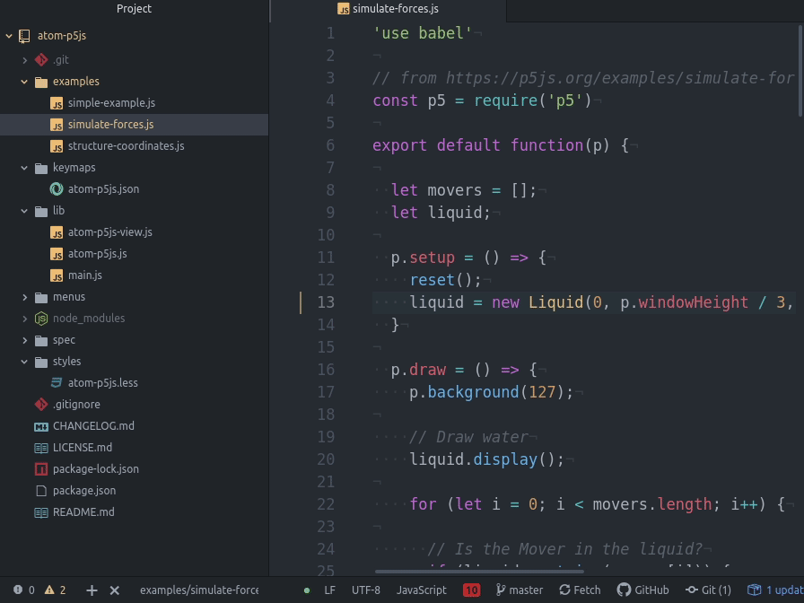

# atom-p5js package

Run your p5js in atom

## Howto
* Write your sketch (look in [examples](./examples) folder for help).
* Save It.
* Execute command `Atom P5js: Eval` into your sketch file. (also with **CTRL+ALT+E**)
* Booom!

Disable p5js visualization with `Atom P5js: Toggle` command (**CTRL+ALT+W**)

## TODO
* p5js sound
